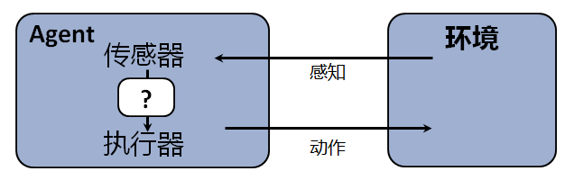

# 第01周：人工智能简介

## 课程介绍（20分钟）

- 本课程由南京邮电大学计算机学院薛景老师负责建设
- 课时安排：36课时理论授课+12课时上机实验
- 准备知识：
    1. [高等数学（微积分）](https://www.icourse163.org/course/NUDT-9004)
    2. [线性代数](https://www.icourse163.org/course/NJUPT-1003270001)
    3. [Python语言程序设计](https://www.icourse163.org/course/NJUPT-1003215002)
    4. [数据结构](https://www.icourse163.org/course/ZJU-93001)
- 参考资料：
    1. [UC Berkeley CS188 Intro to AI](http://ai.berkeley.edu/home.html)
    2. Artificial Intelligence: a Modern Approach, Third Edition. by Stuart Russell & Peter Norvig
    3. 人工智能：一种现代的方法（第3版）. 殷建平，祝恩，刘越 等 译
- 联系我们：
    1. Email：xuejing@njupt.edu.cn
    2. QQ群：10725430

## 现实中的AI应用（10分钟）

- [无人驾驶汽车](https://baike.baidu.com/item/无人驾驶汽车/77997)
- [AlphaGo](https://baike.baidu.com/item/阿尔法围棋/19319610)
- [聊天机器人——微软小冰](https://baike.baidu.com/item/微软小冰)
- [机器翻译](https://baike.baidu.com/item/机器翻译)
- [人脸识别](https://baike.baidu.com/item/人脸识别)
- [推荐系统](https://baike.baidu.com/item/推荐系统/10267357)

## 什么是人工智能（15分钟）

- 制造一台能够实现以下4种不同目的机器的相关科学：
    1. 像人一样思考：认知建模的途径
    2. 像人一样行动：图灵测试的途径
        - 由阿兰·图灵提出的图灵测试的设计旨在为智能提供一个令人满意的可操作的定义。如果一位人类询问者在提出一些书面问题以后不能区分书面回答来自人还是来自计算机，那么这台计算机就通过测试。
        - 阿兰·图灵曾经对​机器是否可以思考给出定义：如果一台机器输出的内容和人类大脑思考后得到的内容别无二致的话，那么就可以认为这台机器在“思考”。
    3. 合理地思考：“思维法则”途径
    4. 合理地行动：合理Agent的途径
- 为了更好地研究人工智能，科学家尝试理解人类大脑的工作方式：
    1. 经验主义：通过对以往历史行为及其结果的分析，做出更加合理的决定
    2. 知识推理：大量地掌握各种知识，通过推理分析，做出更加合理的决定

## AI简史（10分钟）

- 1943年，阿兰·图灵发明了“图灵机“，为智能机器的判定设置了基准：”能够成功骗过人类，让后者以为自己是人类的机器，称为智能机器。”
- 1950年，科幻作家阿西莫夫发表短篇科幻小说集《我，机器人》，书中提出了影响深远的“机器人三原则”。
- 1956年，约翰·麦卡锡首次提出“人工智能”的概念，当时盛行“由上至下“的思路。即由预编程的计算机来管治人类的行为。
- 1968年，首个通用式移动机器人诞生，能够通过周围环境来决定自己的行动。
- 1969年，MIT人工实验室创始人马文·明斯基为导演斯坦利·库布里克的电影《2001漫游太空》担任顾问，塑造了片中超级智能计算机HAL9000的银幕形象。
- 1973年，AI“寒冬“论开始出现。在AI上的巨额投入几乎未收到任何回报和成果，对AI行业的资助开始大幅滑坡。
- 1981年，“窄AI”的概念诞生。更多的研究不在寻求通用智能，而转向了面向更小范围专业任务的“窄AI“领域。
- 1990年，Rodney Brooks提出了“由下自上”的研究思路，开发能够模拟人脑细胞运作方式的神经网络，并学习新的行为。
- 1997年，超级计算机“深蓝”问世，并在国际象棋人机大战中击败人类顶尖棋手、特级大师加里·卡斯帕罗夫
- 2002年，iRobot公司打造出全球首款家用自动化扫地机器人。
- 2005年，美国军方开始投资自动机器人，波士顿动力的"机器狗"是首批产品之一。
- 2008年，谷歌在iPhone上发布了一款语音识别应用，开启了后来数字化语音助手（Siri、Alexa、Cortana）的浪潮。
- 2010年，上海世博会上，来自NAO公司的20个跳舞机器人献上了一段长达8分钟的完美舞蹈。
- 2011年，IBM Watson在Jeopardy答题竞赛中战胜了表现最优秀的人类选手。
- 2014年，在图灵测试诞生64年后，一台名为Eugene Goostman的聊天机器人通过了图灵测试。谷歌向自动驾驶技术投入重金，Skype推出实时语音翻译功能。

## 你眼中的AI（15分钟）

- 一些有趣的视频
    - [浙大最新发布“机器狗”令人惊艳: 技术已能对标国际一流水平](https://v.youku.com/v_show/id_XMzM5NDYxNDQyNA==.html)
    - [索尼爱宝机器狗足球赛精彩射门](https://v.youku.com/v_show/id_XMTY0MzQzNjgw.html)
- 请同学们尝试通过搜索引擎，了解AI技术在各自专业中产生的影响，点燃学习AI领域知识的兴趣。明确的学习目标能够让同学们有的放矢，而浓厚的学习兴趣则能够让你的学习不觉乏味。

## 课程目标：设计合理的Agent（10分钟）
- Agent就是能够行动的某些东西。合理Agent是一个为了实现最佳结果，或者，当存在不确定性时，为了实现最佳期望结果而行动的Agent。

    
- Agent通过传感器感知环境并通过执行器对所处环境产生影响，最简单的例子就是我们自己，一个人类Agent有眼睛、耳朵和其他器官等传感器，也有手、腿、声道等作为执行器。因此，我们通过自身携带的“传感器”感知周围的环境，并且按照大脑发出的一系列指令，使用“执行器”与周围环境发生互动，这样的过程往往会产生一定的结果，我们期望这些结果尽量让我们自己满意，即最佳期望结果。
- 由上例可知，为了在行动后产生最佳期望结果，我们必须在大脑中针对不同的环境变化，设计一系列合理的指令，这些指令就是构成人类Agent的要素。我们用感知来表示任何给定时刻Agent的感知输入，Agent的感知序列是该Agent所收到的所有感知输入数据的完整历史。从数学角度看，上述设计过程就是一个定义Agent函数的过程，Agent函数描述了Agent的行为，它将任意给定感知序列映射为行动。

## 电脑游戏中的合理Agent（10分钟）
- UC Berkeley的老师使用了吃豆人（Pacman）游戏作为整个课程的例子，来讲授和实践人工智能相关知识。在课程建设的起步阶段，我们准备先去复现他们的所有实验。
- 同时，我们在线下也组织了另外一个学习兴趣小组，试图以贪食蛇游戏作为另外一个例子来实践人工智能的相关思想，这是课程的下一个目标。
- 无论是吃豆人，或者是贪食蛇，其中都蕴含了合理Agent的设计思想，即模仿人类玩游戏的思维模式，让游戏角色具备对环境感知并通过使用Agent函数产生合理行动的能力。
