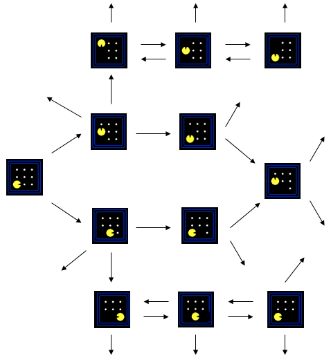
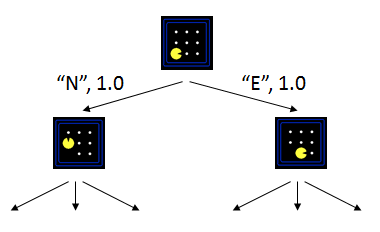

# 第02周：通过搜索进行问题求解：无信息搜索策略

## 简单反射Agent（10分钟）
- 最简单的Agent种类是简单反射Agent。这类Agent基于当前的感知选择行动，不关注感知历史。
- 举例：一个非常形象的例子是一个总是向着最近豆豆的位置前进的吃豆人Agent。
- 总结：简单反射Agent关注的内容是：目前的环境是怎样的？与之对应的行动序列是什么？Agent中包含了环境感知与行动序列的映射关系。

## 基于模型的反射Agent（10分钟）
- 基于模型的反射Agent将会使用模型来计算或推理出适应当前环境的下一步行动，所谓模型就是关于“世界如何运转”的知识。当然，关于世界的模型，有可能使用简单的逻辑电路实现，也有可能使用完备的科学理论实现。
- 举例：一个非常形象的例子是建立一个模型，通过输入吃豆人当前的位置、部分或所有豆豆的位置以及当前关卡中所有障碍物的信息，计算出一套行动序列，只要吃豆人执行这套行动序列，便可以从当前位置开始移动并顺利吃掉所有的豆豆。
- 总结：基于模型的反射Agent，通过研究先验知识，建立一套有效的模型，模型中可以模拟在当前环境下执行各种可能的行动序列所产生的各种后果，从而让Agent选择其中合理的行动序列并执行。

## 问题求解Agent（10分钟）
- 问题求解Agent是一种基于目标的Agent，它将会为了实现某个设定好的目标，找出适应当前环境的合理行动序列。
- 举例：一个非常形象的例子是建立一个以吃掉所有豆豆为目标的Agent，并把吃豆人当前的位置、部分或所有豆豆的位置以及当前关卡中所有障碍物的信息作为环境信息输入给Agent，Agent通过计算或者推理找出一套合理的行动序列，只要吃豆人执行这套行动序列，便可以从当前位置开始移动并顺利吃掉所有的豆豆。
- 总结：问题求解Agent，通过建立目标，并输入所有可用的环境信息，试图找到在当前环境下各种可能的行动序列，并从中选择较合理的行动序列并执行以达到设定的目标。

## 通过搜索求解（10分钟）
- 在对问题进行形式化之后，我们现在需要对问题求解。一个解就是一个行动序列，所以搜索算法的工作就是考虑各种可能的行动序列。
- 一个搜索问题包括：
  1. 状态空间：它是一个表示目前环境信息的所有数据的集合
  2. 后继函数：它能够模拟出在给定的环境下，执行某个行动序列后，产生的结果
  3. 起始状态：这些信息将会告诉Agent从什么样的情形开始搜索
  4. 目标测试：用来检测待测试状态是否能匹配目标布局
- 一个完整的搜索问题，便可以被定义成一个模型。
- 一个解决方案，即一组有效的行动序列，只要在起始状态的周围环境中执行这组行动序列，便可以达到设定的最终目标。
- 举例说明，如果我们想从A地去往B地（A地和B地之间有许多十字路口），那么可能的搜索问题模型应该是：
  1. 状态空间：表示当前所在位置状态的集合
  2. 后继函数：从当前位置走了一段距离后，可以到达的位置
  3. 起始状态：A地
  4. 目标测试：是否已经到达B地
  5. 解决方案：一组行动序列，指导我们在下一个十字路口该如何选择
- 思考题：你能为吃豆人建立一个正确的搜索问题模型吗？

## 状态空间图（10分钟）
- 状态空间图是一种描述搜索问题的数学形式表示，其中：
    - 一个结点表示问题中的一种格局或者状态
    - 一条边表示两个结点之间的联系，可以理解为后继函数，即从一个状态，执行了某些动作后，可以到达与之相连的另一个状态
    - 目标测试是一些目标结点的集合（也可能只有一个目标结点）
- 在一张状态空间图中，相同的结点，只允许出现一次。
- 由于搜索问题中的状态非常非常多，一般我们只能绘制出整个状态空间图的一部分。

    

## 搜索树（10分钟）
- 搜索树是一种用倒置的树形结构表示的搜索状态变化，其中：
    - 搜索的开始状态是树的根结点，在最上方
    - 从根结点开始，整个树自上向下表示某个状态在遇到特定的动作后产生的后继状态
    - 下一层结点是上一层结点所有可能的后继状态
    - 到达某个结点时，所经历的所有的树枝就是一个从开始状态到达该结点状态的所有动作的序列
- 和状态空间图一样，对于大部分的搜索问题，我们一般只能绘制整个搜索树的一小部分。

    

## 无信息搜索策略(uninformed search)（30分钟）
- [深度优先搜索算法(depth-first search)](https://baike.baidu.com/item/深度优先搜索/5224976)：总是扩展搜索树的当前边缘结果集中最深的结点。
- [宽度优先搜索算法(breadth-first search)](https://baike.baidu.com/item/宽度优先搜索)：先扩展根结点，接着扩展所有根结点的所有后继，然后再扩展它们的后继，依此类推。宽度优先搜索是一般图搜索算法的一个实例，每次总是扩展深度最浅的结点。
- 思考题：请你从时间复杂度、空间复杂度、适用场合对上述两种搜索算法进行比较。
- [深度受限搜索算法(depth-limited search)](https://baike.baidu.com/item/深度受限搜索/22717582)：在无限状态空间的条件下，深度优先搜索会令人尴尬地失败，而这个问题可以通过对深度优先搜索设置界限l来避免。就是说，深度为l的结点被当作没有后继结点对待。这种方法称为深度受限搜索。
- [迭代加深的深度优先搜索算法(iterative deepening search)](https://baike.baidu.com/item/迭代深化深度优先搜索)：这是一种常用策略，它经常和深度优先搜索结合使用来确定最好的深度界限。做法是不断地增大深度限制：首先为0，接着为1，然后为2，依此类推……直到找到目标。
- 一致代价搜索(uniform-cost search)：该算法扩展的是路径消耗g(n)最小的结点n。